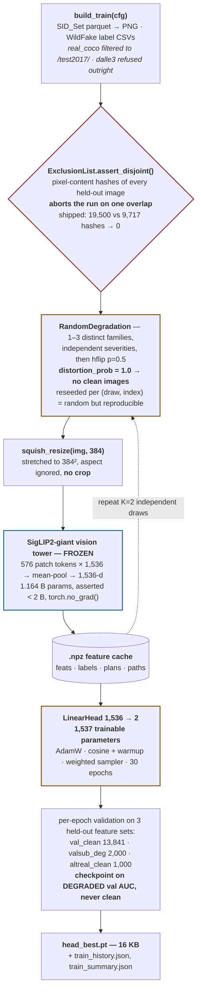
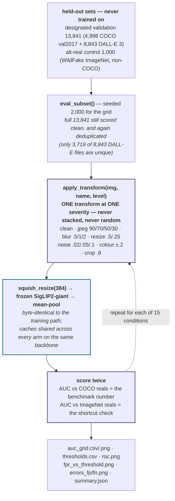

# Pipeline — how an image enters the detector

Traced from `src/train.py`, `src/features.py`, `src/evaluate.py`, `src/data/registry.py`,
`src/degradation/transforms.py`. Rendered version (for slides):
see the *Detector Ingestion Paths* artifact.

Training and evaluation share the resize, the frozen backbone and the transform table. They differ in
**exactly one thing**: training applies *random stacked* degradations, evaluation applies *one fixed*
degradation at a time.

---

## 1. Training ingestion (`mode: frozen`)

**Cost:** 19,500 images × 2 draws = 39,000 forward passes at ~10 img/s — paid once. Afterwards every
head retrain is seconds of CPU, which is what made ~30 ablations affordable on a laptop.

**Why the leakage gate sits before extraction:** it runs on every run with no flag to skip it, so a
violation costs zero GPU time to discover and cannot be forgotten.

---

## 2. Evaluation ingestion

**The shortcut check:** a detector that learned *"looks like COCO → real"* scores far better against
COCO reals than against ImageNet reals. **A large gap is a shortcut, not a success.** Shipped arm: +0.0011.

Two further evaluations reuse this path with different inputs — `scripts/eval_external.py` (Community
Forensics-Eval, RRDataset) and `scripts/resolution_control.py` (degrade only one class and re-score).

---

## 3. The one difference that matters

| | Training | Evaluation |
|---|---|---|
| transforms per image | **1–3, stacked** | **exactly 1** |
| severity | randomly drawn per family | fixed, one grid cell |
| randomness | random, seeded per (draw, index) | deterministic |
| clean images seen | **none** (`distortion_prob = 1.0`) | yes, as its own condition |
| horizontal flip | p = 0.5 | never |
| passes over the data | 2 independent draws | 15 conditions |
| **transform definitions** | **the same table — `src/degradation/transforms.py`, imported by both** ||
| **resize · backbone · pooling** | **identical code path — squish 384², frozen SigLIP2-giant, mean-pool** ||

Sharing one transform table means a robustness score cannot be an artifact of training and evaluation
drifting apart. The trade: the grid is not *independent* of the augmentation — it measures robustness to
the damage we chose to train against, which is why the **external** sets carry the generalization claim
(`docs/REPORT.md` §7.7).

---

## 4. The path we did not ship (`mode: lora`)

End-to-end LoRA changes Diagram 1 in one structural way: **the feature cache disappears.** The backbone
updates, so features cannot be reused and every epoch re-runs all 19,500 images with gradients.

Benchmarked rather than assumed: **~260 s/step at batch 16 = 0.06 img/s → ~18 h/epoch → ~22 days for 30
epochs.** On MPS the backward pass costs ~170× the forward, not the usual ~2×. Rejected on measured cost;
benchmark committed as `scripts/lora_bench.py`.
