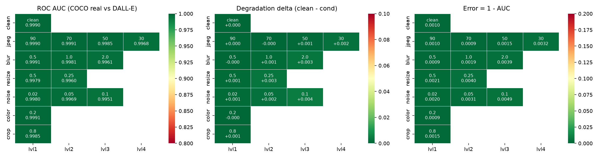

# Robustness Evaluation Summary

Shipped detector: `configs/frozen_siglip2_giant_ship.yaml` (SigLIP2-giant frozen, 1.164 B params, + 16 KB linear head).
Metric: **ROC-AUC** (threshold-free). Grid: seeded 2,000-image subset of the designated validation set
(691 COCO reals / 1,309 DALL-E 3 fakes) + 1,000 ImageNet alt-reals. Clean AUC is also reported on the full
13,841 images. Accuracy is shown only alongside balanced accuracy and the majority baseline (0.6545).

## Clean vs every transform

| Condition | Spec baseline | Benchmark-optimal arm | **Shipped arm** | Shipped, alt-real | Δ vs clean | Bal. acc @0.5 |
|---|---|---|---|---|---|---|
| clean | 0.9214 | 0.9994 | **0.9990** | 0.9980 | +0.0000 | 0.983 |
| jpeg @ 90 | 0.9153 | 0.9995 | **0.9990** | 0.9979 | +0.0000 | 0.983 |
| jpeg @ 70 | 0.9083 | 0.9996 | **0.9991** | 0.9981 | -0.0001 | 0.983 |
| jpeg @ 50 | 0.8805 | 0.9997 | **0.9985** | 0.9974 | +0.0005 | 0.980 |
| jpeg @ 30 | 0.8369 | 0.9996 | **0.9968** | 0.9953 | +0.0023 | 0.972 |
| blur @ 0.5 | 0.9219 | 0.9995 | **0.9991** | 0.9981 | -0.0001 | 0.982 |
| blur @ 1 | 0.9050 | 0.9996 | **0.9981** | 0.9964 | +0.0009 | 0.978 |
| blur @ 2 | 0.8637 | 0.9993 | **0.9961** | 0.9939 | +0.0029 | 0.966 |
| resize @ 0.5 | 0.8925 | 0.9995 | **0.9979** | 0.9963 | +0.0012 | 0.974 |
| resize @ 0.25 | 0.8097 | 0.9996 | **0.9960** | 0.9926 | +0.0030 | 0.965 |
| noise @ 0.02 | 0.9135 | 0.9991 | **0.9980** | 0.9971 | +0.0010 | 0.976 |
| noise @ 0.05 | 0.8790 | 0.9996 | **0.9969** | 0.9949 | +0.0021 | 0.973 |
| noise @ 0.1 | 0.8434 | 0.9998 | **0.9951** | 0.9905 | +0.0039 | 0.964 |
| color @ 0.2 | 0.9240 | 0.9994 | **0.9991** | 0.9982 | -0.0001 | 0.984 |
| crop @ 0.8 | 0.8859 | 0.9994 | **0.9985** | 0.9971 | +0.0006 | 0.979 |

*Spec baseline* = the recipe as originally specified (mixed WildFake slice incl. DALL-E 2). *Benchmark-optimal* =
SID + LAION + MJv5, the highest designated score we reached. *Shipped* = benchmark-optimal + COCO test2017 reals +
six GAN families. Δ is the shipped arm's AUC drop from clean (negative = degraded condition scored *higher*).

## Headline numbers

| | Spec baseline | Benchmark-optimal | **Shipped** |
|---|---|---|---|
| Clean AUC, full set (13,841) | 0.9309 | 0.9994 | **0.9991** |
| Clean AUC, deduplicated (8,717) | 0.9313 | 0.9994 | **0.9991** |
| Worst single transform | resize@0.25 0.8097 | noise@0.02 0.9991 | **noise@0.1 0.9951** |
| Max degradation drop | 0.1118 | 0.0003 | **0.0039** |
| Mean AUC over 14 degraded conditions | 0.8842 | 0.9995 | **0.9977** |
| Accuracy @0.5 / balanced / majority baseline | — | 0.9910 / 0.9915 / 0.6545 | **0.9850 / 0.9856** / 0.6545 |
| Shortcut gap (COCO reals − ImageNet reals) | -0.0270 | -0.0002 | **+0.0011** |
| **External: Community Forensics-Eval** (3,759 imgs, 10 unseen generators) | — | 0.9644¹ | **0.9917** |
| **External: RRDataset** (3,000 imgs, balanced) | — | 0.9318 | **0.9732** |

¹ The benchmark-optimal head was trained on SID 12k; the shipped head on SID 8k. Rebuilt on SID 8k so the
comparison is like-for-like, the benchmark-optimal mix scores 0.9715 on Community Forensics — the shipped
arm's margin is +0.020 either way.

## How to read it

- **Robustness is solved for this transform family.** The shipped arm's worst cell is 0.9951 and its
  largest drop from clean is 0.0039 — all 14 degraded conditions stay above 0.995. The spec
  baseline lost 0.11 on resize 0.25×; that gap was closed entirely by changing training data, not the model.
- **The two external rows are why the shipped arm is not the benchmark-optimal one.** The designated
  benchmark is saturated (0.9994 reachable; ~0.0006 headroom, below the noise floor for 4,998 reals), so it
  can no longer rank arms. On two independent held-out sets the shipped arm wins by +0.02 and +0.04. We
  traded 0.0003 of a number we could no longer measure for gains on two we could.
- **The shortcut gap is the honesty check.** A detector that learned "looks like COCO → real" would score
  much higher on COCO reals than ImageNet reals. Gap is +0.001: no shortcut.
- **Degradation is not where the remaining errors are.** See `ERROR_ANALYSIS.md`: the confident misses are
  the same images clean and degraded.

Reproduce: `python -m src.evaluate --config configs/frozen_siglip2_giant_ship.yaml` (grid) and
`python scripts/eval_external.py --config configs/frozen_siglip2_giant_ship.yaml` (external).
