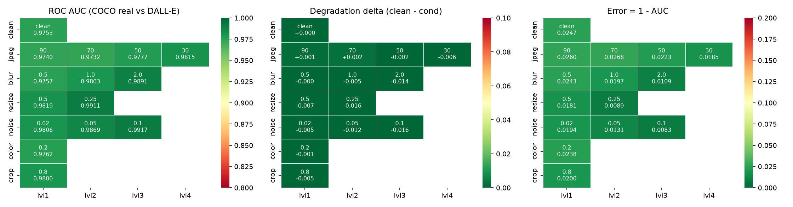
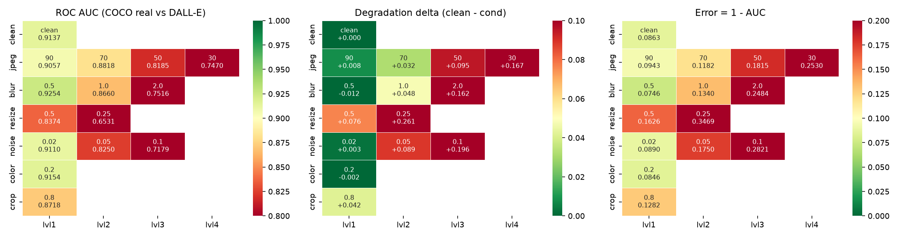
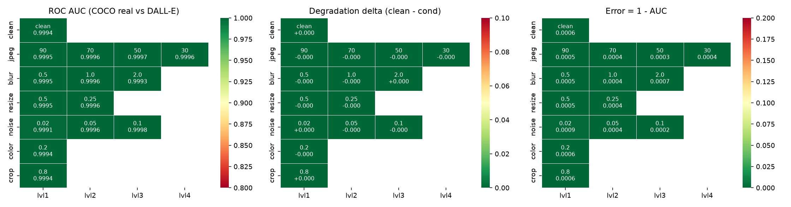
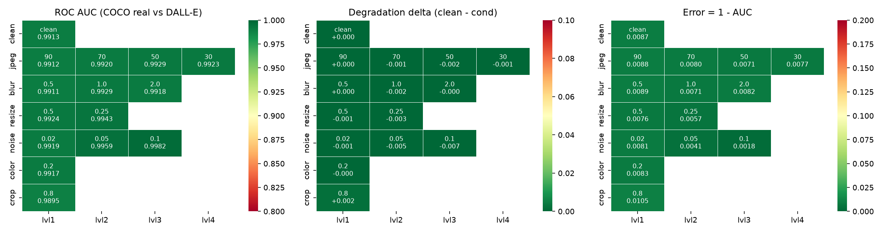

# Results

Auto-generated by `python scripts/make_results.py`. Headline metric: **ROC AUC**.
The designated validation set is class-imbalanced (real:fake about 1:1.77, majority-class accuracy about 0.65), so accuracy is never reported without balanced accuracy and that baseline beside it. Every row is reported against two independent real sets — COCO (the organisers' reals) and a held-out ImageNet set — because a large gap between them would indicate the model learned "looks like COCO" rather than "is real".

## All arms

| arm                             |   clean_auc_full_set | worst_transform   |   worst_auc |   max_delta |   shortcut_gap |   params_B |
|:--------------------------------|---------------------:|:------------------|------------:|------------:|---------------:|-----------:|
| baseline_clip_vitl14_sidonly    |               0.9766 | jpeg@70           |      0.9732 |      0.0021 |        -0.0082 |     0.3030 |
| frozen_siglip2_giant            |               0.9309 | resize@0.25       |      0.8097 |      0.1118 |        -0.0270 |     1.1640 |
| frozen_siglip2_giant_gan        |               0.9197 | resize@0.25       |      0.6531 |      0.2607 |        -0.0176 |     1.1640 |
| frozen_siglip2_giant_harmonized |               0.9316 | resize@0.25       |      0.8106 |      0.1113 |        -0.0268 |     1.1640 |
| frozen_siglip2_giant_mjv5       |               0.9994 | noise@0.02        |      0.9991 |      0.0003 |        -0.0002 |     1.1640 |
| frozen_siglip2_giant_sidonly    |               0.9931 | crop@0.8          |      0.9895 |      0.0018 |        -0.0020 |     1.1640 |

Per-arm reports: [baseline_clip_vitl14_sidonly](baseline_clip_vitl14_sidonly/RESULTS.md) · [frozen_siglip2_giant](frozen_siglip2_giant/RESULTS.md) · [frozen_siglip2_giant_gan](frozen_siglip2_giant_gan/RESULTS.md) · [frozen_siglip2_giant_harmonized](frozen_siglip2_giant_harmonized/RESULTS.md) · [frozen_siglip2_giant_mjv5](frozen_siglip2_giant_mjv5/RESULTS.md) · [frozen_siglip2_giant_sidonly](frozen_siglip2_giant_sidonly/RESULTS.md)

## baseline_clip_vitl14_sidonly

`openai/clip-vit-large-patch14` — 0.303 B parameters (hard limit 2 B, asserted at every model load)

| Measurement | AUC | error (1 − AUC) |
|---|---|---|
| clean, **full** designated val set (n=13841) | **0.9766** | 0.0234 |
| clean, full set **deduplicated** (n=8717: 4998 real / 3719 unique fake) | 0.9770 | 0.0230 |
| clean, eval subset, fakes vs COCO reals | 0.9753 | 0.0247 |
| clean, eval subset, fakes vs **ImageNet (alt) reals** | 0.9835 | 0.0165 |
| worst single transform: `jpeg@70` | 0.9732 (alt real 0.9816) | 0.0268 |

**Shortcut gap (COCO-real AUC − alt-real AUC, clean): -0.0082** — a large positive gap would mean the model is exploiting the COCO capture pipeline rather than detecting generation.

Max degradation delta: **0.0021** · mean degraded AUC: 0.9814

Accuracy at threshold 0.5 on the full set: 0.9041, balanced accuracy 0.9161 — against a majority-class baseline of 0.6545 (class ratio 1:1.89).

### Per-transform grid (eval subset)

| transform   |   level |   auc_coco_real |   delta_coco |   err_coco_real |   auc_alt_real |   shortcut_gap |   bal_acc@0.5 |
|:------------|--------:|----------------:|-------------:|----------------:|---------------:|---------------:|--------------:|
| clean       |         |          0.9753 |       0.0000 |          0.0247 |         0.9835 |        -0.0082 |        0.9091 |
| jpeg        | 90.0000 |          0.9740 |       0.0014 |          0.0260 |         0.9828 |        -0.0088 |        0.9081 |
| jpeg        | 70.0000 |          0.9732 |       0.0021 |          0.0268 |         0.9816 |        -0.0084 |        0.9037 |
| jpeg        | 50.0000 |          0.9777 |      -0.0023 |          0.0223 |         0.9848 |        -0.0072 |        0.9112 |
| jpeg        | 30.0000 |          0.9815 |      -0.0062 |          0.0185 |         0.9876 |        -0.0061 |        0.9173 |
| blur        |  0.5000 |          0.9757 |      -0.0003 |          0.0243 |         0.9841 |        -0.0085 |        0.9116 |
| blur        |  1.0000 |          0.9803 |      -0.0049 |          0.0197 |         0.9882 |        -0.0079 |        0.9141 |
| blur        |  2.0000 |          0.9891 |      -0.0138 |          0.0109 |         0.9945 |        -0.0054 |        0.9214 |
| resize      |  0.5000 |          0.9819 |      -0.0066 |          0.0181 |         0.9903 |        -0.0084 |        0.9177 |
| resize      |  0.2500 |          0.9911 |      -0.0158 |          0.0089 |         0.9959 |        -0.0048 |        0.9228 |
| noise       |  0.0200 |          0.9806 |      -0.0052 |          0.0194 |         0.9875 |        -0.0069 |        0.9173 |
| noise       |  0.0500 |          0.9869 |      -0.0116 |          0.0131 |         0.9913 |        -0.0044 |        0.9199 |
| noise       |  0.1000 |          0.9917 |      -0.0164 |          0.0083 |         0.9953 |        -0.0036 |        0.9128 |
| color       |  0.2000 |          0.9762 |      -0.0008 |          0.0238 |         0.9839 |        -0.0077 |        0.9085 |
| crop        |  0.8000 |          0.9800 |      -0.0047 |          0.0200 |         0.9859 |        -0.0059 |        0.9108 |

### Operating points (clean images)

`FPR_real` is the fraction of genuine photos wrongly flagged; on a platform serving billions of images this is the cost that matters, which is why it is reported per threshold rather than only as a single accuracy figure.

|   threshold |   FPR_real |   TPR_fake | note        |
|------------:|-----------:|-----------:|:------------|
|      0.1000 |     0.2012 |     0.9786 |             |
|      0.2000 |     0.1346 |     0.9496 |             |
|      0.3000 |     0.1056 |     0.9290 |             |
|      0.4000 |     0.0767 |     0.9022 |             |
|      0.5000 |     0.0535 |     0.8717 |             |
|      0.6000 |     0.0376 |     0.8358 |             |
|      0.7000 |     0.0217 |     0.8006 |             |
|      0.8000 |     0.0159 |     0.7395 |             |
|      0.9000 |     0.0072 |     0.6402 |             |
|      0.9500 |     0.0014 |     0.5332 |             |
|      0.9900 |     0.0000 |     0.2857 |             |
|      0.9623 |     0.0000 |     0.4874 | @FPR<=0.001 |
|      0.8492 |     0.0087 |     0.7013 | @FPR<=0.01  |
|      0.5158 |     0.0492 |     0.8694 | @FPR<=0.05  |

### Figures

- ROC curve: `baseline_clip_vitl14_sidonly/eval/roc.png`
- FPR vs threshold: `baseline_clip_vitl14_sidonly/eval/fpr_vs_threshold.png`
- Error analysis contact sheets: `baseline_clip_vitl14_sidonly/eval/errors_fp.png` (false positives), `baseline_clip_vitl14_sidonly/eval/errors_fn.png` (false negatives), `baseline_clip_vitl14_sidonly/eval/errors_top.csv`
- Checkpoint / training history: `baseline_clip_vitl14_sidonly/head_best.pt`, `baseline_clip_vitl14_sidonly/train_history.json`

---

## frozen_siglip2_giant

`google/siglip2-giant-opt-patch16-384` — 1.164 B parameters (hard limit 2 B, asserted at every model load)

| Measurement | AUC | error (1 − AUC) |
|---|---|---|
| clean, **full** designated val set (n=13841) | **0.9309** | 0.0691 |
| clean, full set **deduplicated** (n=8717: 4998 real / 3719 unique fake) | 0.9313 | 0.0687 |
| clean, eval subset, fakes vs COCO reals | 0.9214 | 0.0786 |
| clean, eval subset, fakes vs **ImageNet (alt) reals** | 0.9484 | 0.0516 |
| worst single transform: `resize@0.25` | 0.8097 (alt real 0.8640) | 0.1903 |

**Shortcut gap (COCO-real AUC − alt-real AUC, clean): -0.0270** — a large positive gap would mean the model is exploiting the COCO capture pipeline rather than detecting generation.

Max degradation delta: **0.1118** · mean degraded AUC: 0.8842

Accuracy at threshold 0.5 on the full set: 0.8637, balanced accuracy 0.8602 — against a majority-class baseline of 0.6545 (class ratio 1:1.89).

### Per-transform grid (eval subset)

| transform   |   level |   auc_coco_real |   delta_coco |   err_coco_real |   auc_alt_real |   shortcut_gap |   bal_acc@0.5 |
|:------------|--------:|----------------:|-------------:|----------------:|---------------:|---------------:|--------------:|
| clean       |         |          0.9214 |       0.0000 |          0.0786 |         0.9484 |        -0.0270 |        0.8531 |
| jpeg        | 90.0000 |          0.9153 |       0.0061 |          0.0847 |         0.9437 |        -0.0284 |        0.8438 |
| jpeg        | 70.0000 |          0.9083 |       0.0132 |          0.0917 |         0.9424 |        -0.0341 |        0.8283 |
| jpeg        | 50.0000 |          0.8805 |       0.0410 |          0.1195 |         0.9247 |        -0.0443 |        0.7941 |
| jpeg        | 30.0000 |          0.8369 |       0.0846 |          0.1631 |         0.8990 |        -0.0621 |        0.7448 |
| blur        |  0.5000 |          0.9219 |      -0.0005 |          0.0781 |         0.9481 |        -0.0261 |        0.8527 |
| blur        |  1.0000 |          0.9050 |       0.0165 |          0.0950 |         0.9366 |        -0.0316 |        0.8197 |
| blur        |  2.0000 |          0.8637 |       0.0577 |          0.1363 |         0.9107 |        -0.0470 |        0.7540 |
| resize      |  0.5000 |          0.8925 |       0.0289 |          0.1075 |         0.9300 |        -0.0375 |        0.7935 |
| resize      |  0.2500 |          0.8097 |       0.1118 |          0.1903 |         0.8640 |        -0.0544 |        0.6524 |
| noise       |  0.0200 |          0.9135 |       0.0080 |          0.0865 |         0.9452 |        -0.0317 |        0.8398 |
| noise       |  0.0500 |          0.8790 |       0.0425 |          0.1210 |         0.9220 |        -0.0430 |        0.8083 |
| noise       |  0.1000 |          0.8434 |       0.0781 |          0.1566 |         0.8913 |        -0.0479 |        0.7565 |
| color       |  0.2000 |          0.9240 |      -0.0026 |          0.0760 |         0.9510 |        -0.0270 |        0.8584 |
| crop        |  0.8000 |          0.8859 |       0.0356 |          0.1141 |         0.9237 |        -0.0378 |        0.7873 |

### Data ablation: `sid_only_ablation`

Same frozen features and the same head-training procedure — only the training sources differ.

| transform   |   level |   auc_coco_real |   delta_coco |   auc_alt_real |
|:------------|--------:|----------------:|-------------:|---------------:|
| clean       |         |          0.9924 |       0.0000 |         0.9944 |
| jpeg        | 90.0000 |          0.9905 |       0.0019 |         0.9931 |
| jpeg        | 70.0000 |          0.9918 |       0.0006 |         0.9941 |
| jpeg        | 50.0000 |          0.9932 |      -0.0008 |         0.9950 |
| jpeg        | 30.0000 |          0.9928 |      -0.0004 |         0.9952 |
| blur        |  0.5000 |          0.9900 |       0.0024 |         0.9932 |
| blur        |  1.0000 |          0.9914 |       0.0010 |         0.9951 |
| blur        |  2.0000 |          0.9912 |       0.0012 |         0.9948 |
| resize      |  0.5000 |          0.9914 |       0.0010 |         0.9951 |
| resize      |  0.2500 |          0.9942 |      -0.0018 |         0.9968 |
| noise       |  0.0200 |          0.9917 |       0.0007 |         0.9947 |
| noise       |  0.0500 |          0.9959 |      -0.0035 |         0.9975 |
| noise       |  0.1000 |          0.9982 |      -0.0058 |         0.9988 |
| color       |  0.2000 |          0.9909 |       0.0014 |         0.9940 |
| crop        |  0.8000 |          0.9888 |       0.0036 |         0.9921 |

### Operating points (clean images)

`FPR_real` is the fraction of genuine photos wrongly flagged; on a platform serving billions of images this is the cost that matters, which is why it is reported per threshold rather than only as a single accuracy figure.

|   threshold |   FPR_real |   TPR_fake | note        |
|------------:|-----------:|-----------:|:------------|
|      0.1000 |     0.4689 |     0.9496 |             |
|      0.2000 |     0.3300 |     0.9251 |             |
|      0.3000 |     0.2475 |     0.9030 |             |
|      0.4000 |     0.2041 |     0.8785 |             |
|      0.5000 |     0.1548 |     0.8610 |             |
|      0.6000 |     0.1172 |     0.8373 |             |
|      0.7000 |     0.0970 |     0.8105 |             |
|      0.8000 |     0.0796 |     0.7800 |             |
|      0.9000 |     0.0420 |     0.7212 |             |
|      0.9500 |     0.0203 |     0.6532 |             |
|      0.9900 |     0.0058 |     0.4408 |             |
|      0.9966 |     0.0000 |     0.2903 | @FPR<=0.001 |
|      0.9740 |     0.0087 |     0.5684 | @FPR<=0.01  |
|      0.8771 |     0.0492 |     0.7403 | @FPR<=0.05  |

### Figures

- ROC curve: `frozen_siglip2_giant/eval/roc.png`
- FPR vs threshold: `frozen_siglip2_giant/eval/fpr_vs_threshold.png`
- Error analysis contact sheets: `frozen_siglip2_giant/eval/errors_fp.png` (false positives), `frozen_siglip2_giant/eval/errors_fn.png` (false negatives), `frozen_siglip2_giant/eval/errors_top.csv`
- Checkpoint / training history: `frozen_siglip2_giant/head_best.pt`, `frozen_siglip2_giant/train_history.json`

---

## frozen_siglip2_giant_gan

`google/siglip2-giant-opt-patch16-384` — 1.164 B parameters (hard limit 2 B, asserted at every model load)

| Measurement | AUC | error (1 − AUC) |
|---|---|---|
| clean, **full** designated val set (n=13841) | **0.9197** | 0.0803 |
| clean, full set **deduplicated** (n=8717: 4998 real / 3719 unique fake) | 0.9205 | 0.0795 |
| clean, eval subset, fakes vs COCO reals | 0.9137 | 0.0863 |
| clean, eval subset, fakes vs **ImageNet (alt) reals** | 0.9313 | 0.0687 |
| worst single transform: `resize@0.25` | 0.6531 (alt real 0.6963) | 0.3469 |

**Shortcut gap (COCO-real AUC − alt-real AUC, clean): -0.0176** — a large positive gap would mean the model is exploiting the COCO capture pipeline rather than detecting generation.

Max degradation delta: **0.2607** · mean degraded AUC: 0.8305

Accuracy at threshold 0.5 on the full set: 0.8441, balanced accuracy 0.8263 — against a majority-class baseline of 0.6545 (class ratio 1:1.89).

### Per-transform grid (eval subset)

| transform   |   level |   auc_coco_real |   delta_coco |   err_coco_real |   auc_alt_real |   shortcut_gap |   bal_acc@0.5 |
|:------------|--------:|----------------:|-------------:|----------------:|---------------:|---------------:|--------------:|
| clean       |         |          0.9137 |       0.0000 |          0.0863 |         0.9313 |        -0.0176 |        0.8228 |
| jpeg        | 90.0000 |          0.9057 |       0.0080 |          0.0943 |         0.9237 |        -0.0180 |        0.8152 |
| jpeg        | 70.0000 |          0.8818 |       0.0319 |          0.1182 |         0.9109 |        -0.0291 |        0.7613 |
| jpeg        | 50.0000 |          0.8185 |       0.0953 |          0.1815 |         0.8626 |        -0.0441 |        0.6794 |
| jpeg        | 30.0000 |          0.7470 |       0.1667 |          0.2530 |         0.8105 |        -0.0635 |        0.6147 |
| blur        |  0.5000 |          0.9254 |      -0.0117 |          0.0746 |         0.9381 |        -0.0127 |        0.8396 |
| blur        |  1.0000 |          0.8660 |       0.0478 |          0.1340 |         0.8828 |        -0.0168 |        0.7367 |
| blur        |  2.0000 |          0.7516 |       0.1621 |          0.2484 |         0.7962 |        -0.0446 |        0.5787 |
| resize      |  0.5000 |          0.8374 |       0.0763 |          0.1626 |         0.8641 |        -0.0268 |        0.6938 |
| resize      |  0.2500 |          0.6531 |       0.2607 |          0.3469 |         0.6963 |        -0.0433 |        0.5234 |
| noise       |  0.0200 |          0.9110 |       0.0027 |          0.0890 |         0.9318 |        -0.0208 |        0.8320 |
| noise       |  0.0500 |          0.8250 |       0.0888 |          0.1750 |         0.8628 |        -0.0378 |        0.7109 |
| noise       |  0.1000 |          0.7179 |       0.1958 |          0.2821 |         0.7610 |        -0.0431 |        0.5798 |
| color       |  0.2000 |          0.9154 |      -0.0017 |          0.0846 |         0.9337 |        -0.0183 |        0.8202 |
| crop        |  0.8000 |          0.8718 |       0.0419 |          0.1282 |         0.8949 |        -0.0231 |        0.7579 |

### Operating points (clean images)

`FPR_real` is the fraction of genuine photos wrongly flagged; on a platform serving billions of images this is the cost that matters, which is why it is reported per threshold rather than only as a single accuracy figure.

|   threshold |   FPR_real |   TPR_fake | note        |
|------------:|-----------:|-----------:|:------------|
|      0.1000 |     0.5572 |     0.9580 |             |
|      0.2000 |     0.4298 |     0.9358 |             |
|      0.3000 |     0.3357 |     0.9221 |             |
|      0.4000 |     0.2894 |     0.9030 |             |
|      0.5000 |     0.2330 |     0.8785 |             |
|      0.6000 |     0.1939 |     0.8625 |             |
|      0.7000 |     0.1548 |     0.8365 |             |
|      0.8000 |     0.1245 |     0.8067 |             |
|      0.9000 |     0.0695 |     0.7426 |             |
|      0.9500 |     0.0391 |     0.6860 |             |
|      0.9900 |     0.0087 |     0.5073 |             |
|      0.9992 |     0.0000 |     0.2040 | @FPR<=0.001 |
|      0.9895 |     0.0087 |     0.5118 | @FPR<=0.01  |
|      0.9206 |     0.0492 |     0.7257 | @FPR<=0.05  |

### Figures

- ROC curve: `frozen_siglip2_giant_gan/eval/roc.png`
- FPR vs threshold: `frozen_siglip2_giant_gan/eval/fpr_vs_threshold.png`
- Error analysis contact sheets: `frozen_siglip2_giant_gan/eval/errors_fp.png` (false positives), `frozen_siglip2_giant_gan/eval/errors_fn.png` (false negatives), `frozen_siglip2_giant_gan/eval/errors_top.csv`
- Checkpoint / training history: `frozen_siglip2_giant_gan/head_best.pt`, `frozen_siglip2_giant_gan/train_history.json`

---

## frozen_siglip2_giant_harmonized

`google/siglip2-giant-opt-patch16-384` — 1.164 B parameters (hard limit 2 B, asserted at every model load)

| Measurement | AUC | error (1 − AUC) |
|---|---|---|
| clean, **full** designated val set (n=13841) | **0.9316** | 0.0684 |
| clean, full set **deduplicated** (n=8717: 4998 real / 3719 unique fake) | 0.9318 | 0.0682 |
| clean, eval subset, fakes vs COCO reals | 0.9219 | 0.0781 |
| clean, eval subset, fakes vs **ImageNet (alt) reals** | 0.9487 | 0.0513 |
| worst single transform: `resize@0.25` | 0.8106 (alt real 0.8648) | 0.1894 |

**Shortcut gap (COCO-real AUC − alt-real AUC, clean): -0.0268** — a large positive gap would mean the model is exploiting the COCO capture pipeline rather than detecting generation.

Max degradation delta: **0.1113** · mean degraded AUC: 0.8858

Accuracy at threshold 0.5 on the full set: 0.8649, balanced accuracy 0.8621 — against a majority-class baseline of 0.6545 (class ratio 1:1.89).

### Per-transform grid (eval subset)

| transform   |   level |   auc_coco_real |   delta_coco |   err_coco_real |   auc_alt_real |   shortcut_gap |   bal_acc@0.5 |
|:------------|--------:|----------------:|-------------:|----------------:|---------------:|---------------:|--------------:|
| clean       |         |          0.9219 |       0.0000 |          0.0781 |         0.9487 |        -0.0268 |        0.8519 |
| jpeg        | 90.0000 |          0.9159 |       0.0061 |          0.0841 |         0.9441 |        -0.0282 |        0.8449 |
| jpeg        | 70.0000 |          0.9108 |       0.0112 |          0.0892 |         0.9438 |        -0.0330 |        0.8341 |
| jpeg        | 50.0000 |          0.8846 |       0.0374 |          0.1154 |         0.9273 |        -0.0427 |        0.8024 |
| jpeg        | 30.0000 |          0.8433 |       0.0786 |          0.1567 |         0.9038 |        -0.0605 |        0.7473 |
| blur        |  0.5000 |          0.9230 |      -0.0011 |          0.0770 |         0.9489 |        -0.0259 |        0.8516 |
| blur        |  1.0000 |          0.9068 |       0.0151 |          0.0932 |         0.9376 |        -0.0308 |        0.8249 |
| blur        |  2.0000 |          0.8650 |       0.0570 |          0.1350 |         0.9116 |        -0.0466 |        0.7518 |
| resize      |  0.5000 |          0.8944 |       0.0275 |          0.1056 |         0.9314 |        -0.0370 |        0.7956 |
| resize      |  0.2500 |          0.8106 |       0.1113 |          0.1894 |         0.8648 |        -0.0542 |        0.6484 |
| noise       |  0.0200 |          0.9125 |       0.0094 |          0.0875 |         0.9444 |        -0.0319 |        0.8373 |
| noise       |  0.0500 |          0.8798 |       0.0421 |          0.1202 |         0.9226 |        -0.0427 |        0.8044 |
| noise       |  0.1000 |          0.8450 |       0.0769 |          0.1550 |         0.8924 |        -0.0474 |        0.7628 |
| color       |  0.2000 |          0.9241 |      -0.0021 |          0.0759 |         0.9510 |        -0.0269 |        0.8584 |
| crop        |  0.8000 |          0.8852 |       0.0367 |          0.1148 |         0.9234 |        -0.0382 |        0.7925 |

### Data ablation: `sid_plus_dalle2`

Same frozen features and the same head-training procedure — only the training sources differ.

Trained on 13000 features from sources matching `['sid_set', 'DALLE2']`. Clean AUC (full set) **0.9691**, worst cell `resize@0.25` 0.8710, max delta 0.0912.

| transform   |   level |   auc_coco_real |   delta_coco |   err_coco_real |   auc_alt_real |   shortcut_gap |
|:------------|--------:|----------------:|-------------:|----------------:|---------------:|---------------:|
| clean       |         |          0.9622 |       0.0000 |          0.0378 |         0.9683 |        -0.0061 |
| jpeg        | 90.0000 |          0.9575 |       0.0047 |          0.0425 |         0.9645 |        -0.0070 |
| jpeg        | 70.0000 |          0.9536 |       0.0086 |          0.0464 |         0.9634 |        -0.0097 |
| jpeg        | 50.0000 |          0.9369 |       0.0254 |          0.0631 |         0.9523 |        -0.0154 |
| jpeg        | 30.0000 |          0.9121 |       0.0502 |          0.0879 |         0.9353 |        -0.0233 |
| blur        |  0.5000 |          0.9615 |       0.0008 |          0.0385 |         0.9677 |        -0.0062 |
| blur        |  1.0000 |          0.9481 |       0.0142 |          0.0519 |         0.9581 |        -0.0100 |
| blur        |  2.0000 |          0.9163 |       0.0459 |          0.0837 |         0.9323 |        -0.0159 |
| resize      |  0.5000 |          0.9389 |       0.0234 |          0.0611 |         0.9519 |        -0.0130 |
| resize      |  0.2500 |          0.8710 |       0.0912 |          0.1290 |         0.8861 |        -0.0151 |
| noise       |  0.0200 |          0.9585 |       0.0038 |          0.0415 |         0.9673 |        -0.0089 |
| noise       |  0.0500 |          0.9388 |       0.0234 |          0.0612 |         0.9522 |        -0.0134 |
| noise       |  0.1000 |          0.9125 |       0.0497 |          0.0875 |         0.9243 |        -0.0118 |
| color       |  0.2000 |          0.9647 |      -0.0024 |          0.0353 |         0.9710 |        -0.0064 |
| crop        |  0.8000 |          0.9385 |       0.0237 |          0.0615 |         0.9488 |        -0.0102 |

### Data ablation: `sid_plus_laion`

Same frozen features and the same head-training procedure — only the training sources differ.

Trained on 14000 features from sources matching `['sid_set', 'laion5b']`. Clean AUC (full set) **0.9891**, worst cell `crop@0.8` 0.9851, max delta 0.0012.

| transform   |   level |   auc_coco_real |   delta_coco |   err_coco_real |   auc_alt_real |   shortcut_gap |
|:------------|--------:|----------------:|-------------:|----------------:|---------------:|---------------:|
| clean       |         |          0.9863 |       0.0000 |          0.0137 |         0.9926 |        -0.0063 |
| jpeg        | 90.0000 |          0.9870 |      -0.0007 |          0.0130 |         0.9929 |        -0.0059 |
| jpeg        | 70.0000 |          0.9889 |      -0.0025 |          0.0111 |         0.9940 |        -0.0051 |
| jpeg        | 50.0000 |          0.9897 |      -0.0034 |          0.0103 |         0.9943 |        -0.0046 |
| jpeg        | 30.0000 |          0.9884 |      -0.0021 |          0.0116 |         0.9942 |        -0.0058 |
| blur        |  0.5000 |          0.9865 |      -0.0001 |          0.0135 |         0.9930 |        -0.0065 |
| blur        |  1.0000 |          0.9885 |      -0.0022 |          0.0115 |         0.9950 |        -0.0065 |
| blur        |  2.0000 |          0.9869 |      -0.0006 |          0.0131 |         0.9941 |        -0.0072 |
| resize      |  0.5000 |          0.9881 |      -0.0017 |          0.0119 |         0.9947 |        -0.0067 |
| resize      |  0.2500 |          0.9915 |      -0.0051 |          0.0085 |         0.9966 |        -0.0051 |
| noise       |  0.0200 |          0.9854 |       0.0010 |          0.0146 |         0.9925 |        -0.0071 |
| noise       |  0.0500 |          0.9909 |      -0.0046 |          0.0091 |         0.9957 |        -0.0048 |
| noise       |  0.1000 |          0.9950 |      -0.0087 |          0.0050 |         0.9977 |        -0.0027 |
| color       |  0.2000 |          0.9866 |      -0.0002 |          0.0134 |         0.9932 |        -0.0066 |
| crop        |  0.8000 |          0.9851 |       0.0012 |          0.0149 |         0.9924 |        -0.0072 |

### Data ablation: `sid_set`

Same frozen features and the same head-training procedure — only the training sources differ.

Trained on 8000 features from sources matching `['sid_set']`. Clean AUC (full set) **0.9932**, worst cell `crop@0.8` 0.9899, max delta 0.0016.

| transform   |   level |   auc_coco_real |   delta_coco |   err_coco_real |   auc_alt_real |   shortcut_gap |
|:------------|--------:|----------------:|-------------:|----------------:|---------------:|---------------:|
| clean       |         |          0.9915 |       0.0000 |          0.0085 |         0.9936 |        -0.0021 |
| jpeg        | 90.0000 |          0.9914 |       0.0001 |          0.0086 |         0.9934 |        -0.0020 |
| jpeg        | 70.0000 |          0.9922 |      -0.0007 |          0.0078 |         0.9942 |        -0.0020 |
| jpeg        | 50.0000 |          0.9930 |      -0.0015 |          0.0070 |         0.9947 |        -0.0017 |
| jpeg        | 30.0000 |          0.9923 |      -0.0007 |          0.0077 |         0.9947 |        -0.0024 |
| blur        |  0.5000 |          0.9914 |       0.0001 |          0.0086 |         0.9939 |        -0.0025 |
| blur        |  1.0000 |          0.9928 |      -0.0013 |          0.0072 |         0.9958 |        -0.0029 |
| blur        |  2.0000 |          0.9916 |      -0.0001 |          0.0084 |         0.9949 |        -0.0033 |
| resize      |  0.5000 |          0.9923 |      -0.0008 |          0.0077 |         0.9955 |        -0.0031 |
| resize      |  0.2500 |          0.9941 |      -0.0026 |          0.0059 |         0.9967 |        -0.0026 |
| noise       |  0.0200 |          0.9920 |      -0.0005 |          0.0080 |         0.9947 |        -0.0027 |
| noise       |  0.0500 |          0.9959 |      -0.0044 |          0.0041 |         0.9973 |        -0.0014 |
| noise       |  0.1000 |          0.9982 |      -0.0066 |          0.0018 |         0.9986 |        -0.0005 |
| color       |  0.2000 |          0.9919 |      -0.0004 |          0.0081 |         0.9943 |        -0.0025 |
| crop        |  0.8000 |          0.9899 |       0.0016 |          0.0101 |         0.9928 |        -0.0028 |

### Data ablation: `wildfake`

Same frozen features and the same head-training procedure — only the training sources differ.

Trained on 11000 features from sources matching `['wildfake']`. Clean AUC (full set) **0.6234**, worst cell `noise@0.1` 0.2633, max delta 0.3463.

| transform   |   level |   auc_coco_real |   delta_coco |   err_coco_real |   auc_alt_real |   shortcut_gap |
|:------------|--------:|----------------:|-------------:|----------------:|---------------:|---------------:|
| clean       |         |          0.6096 |       0.0000 |          0.3904 |         0.7017 |        -0.0922 |
| jpeg        | 90.0000 |          0.5784 |       0.0311 |          0.4216 |         0.6745 |        -0.0960 |
| jpeg        | 70.0000 |          0.5433 |       0.0662 |          0.4567 |         0.6543 |        -0.1109 |
| jpeg        | 50.0000 |          0.4222 |       0.1873 |          0.5778 |         0.5377 |        -0.1155 |
| jpeg        | 30.0000 |          0.3096 |       0.3000 |          0.6904 |         0.4288 |        -0.1192 |
| blur        |  0.5000 |          0.6134 |      -0.0038 |          0.3866 |         0.6983 |        -0.0849 |
| blur        |  1.0000 |          0.4866 |       0.1229 |          0.5134 |         0.5739 |        -0.0872 |
| blur        |  2.0000 |          0.3511 |       0.2584 |          0.6489 |         0.4452 |        -0.0941 |
| resize      |  0.5000 |          0.4438 |       0.1658 |          0.5562 |         0.5404 |        -0.0966 |
| resize      |  0.2500 |          0.2668 |       0.3427 |          0.7332 |         0.3409 |        -0.0741 |
| noise       |  0.0200 |          0.5821 |       0.0274 |          0.4179 |         0.6796 |        -0.0975 |
| noise       |  0.0500 |          0.3820 |       0.2275 |          0.6180 |         0.4840 |        -0.1020 |
| noise       |  0.1000 |          0.2633 |       0.3463 |          0.7367 |         0.3444 |        -0.0811 |
| color       |  0.2000 |          0.6209 |      -0.0114 |          0.3791 |         0.7119 |        -0.0910 |
| crop        |  0.8000 |          0.4952 |       0.1143 |          0.5048 |         0.5983 |        -0.1031 |

### Operating points (clean images)

`FPR_real` is the fraction of genuine photos wrongly flagged; on a platform serving billions of images this is the cost that matters, which is why it is reported per threshold rather than only as a single accuracy figure.

|   threshold |   FPR_real |   TPR_fake | note        |
|------------:|-----------:|-----------:|:------------|
|      0.1000 |     0.4689 |     0.9473 |             |
|      0.2000 |     0.3242 |     0.9274 |             |
|      0.3000 |     0.2446 |     0.9045 |             |
|      0.4000 |     0.1968 |     0.8778 |             |
|      0.5000 |     0.1548 |     0.8587 |             |
|      0.6000 |     0.1158 |     0.8335 |             |
|      0.7000 |     0.0999 |     0.8067 |             |
|      0.8000 |     0.0738 |     0.7823 |             |
|      0.9000 |     0.0449 |     0.7265 |             |
|      0.9500 |     0.0217 |     0.6593 |             |
|      0.9900 |     0.0058 |     0.4500 |             |
|      0.9966 |     0.0000 |     0.3010 | @FPR<=0.001 |
|      0.9740 |     0.0087 |     0.5775 | @FPR<=0.01  |
|      0.8802 |     0.0492 |     0.7395 | @FPR<=0.05  |

### Figures

- ROC curve: `frozen_siglip2_giant_harmonized/eval/roc.png`
- FPR vs threshold: `frozen_siglip2_giant_harmonized/eval/fpr_vs_threshold.png`
- Error analysis contact sheets: `frozen_siglip2_giant_harmonized/eval/errors_fp.png` (false positives), `frozen_siglip2_giant_harmonized/eval/errors_fn.png` (false negatives), `frozen_siglip2_giant_harmonized/eval/errors_top.csv`
- Checkpoint / training history: `frozen_siglip2_giant_harmonized/head_best.pt`, `frozen_siglip2_giant_harmonized/train_history.json`

---

## frozen_siglip2_giant_mjv5

`google/siglip2-giant-opt-patch16-384` — 1.164 B parameters (hard limit 2 B, asserted at every model load)

| Measurement | AUC | error (1 − AUC) |
|---|---|---|
| clean, **full** designated val set (n=13841) | **0.9994** | 0.0006 |
| clean, full set **deduplicated** (n=8717: 4998 real / 3719 unique fake) | 0.9994 | 0.0006 |
| clean, eval subset, fakes vs COCO reals | 0.9994 | 0.0006 |
| clean, eval subset, fakes vs **ImageNet (alt) reals** | 0.9996 | 0.0004 |
| worst single transform: `noise@0.02` | 0.9991 (alt real 0.9995) | 0.0009 |

**Shortcut gap (COCO-real AUC − alt-real AUC, clean): -0.0002** — a large positive gap would mean the model is exploiting the COCO capture pipeline rather than detecting generation.

Max degradation delta: **0.0003** · mean degraded AUC: 0.9995

Accuracy at threshold 0.5 on the full set: 0.9910, balanced accuracy 0.9915 — against a majority-class baseline of 0.6545 (class ratio 1:1.89).

### Per-transform grid (eval subset)

| transform   |   level |   auc_coco_real |   delta_coco |   err_coco_real |   auc_alt_real |   shortcut_gap |   bal_acc@0.5 |
|:------------|--------:|----------------:|-------------:|----------------:|---------------:|---------------:|--------------:|
| clean       |         |          0.9994 |       0.0000 |          0.0006 |         0.9996 |        -0.0002 |        0.9907 |
| jpeg        | 90.0000 |          0.9995 |      -0.0001 |          0.0005 |         0.9996 |        -0.0002 |        0.9906 |
| jpeg        | 70.0000 |          0.9996 |      -0.0003 |          0.0004 |         0.9997 |        -0.0001 |        0.9921 |
| jpeg        | 50.0000 |          0.9997 |      -0.0003 |          0.0003 |         0.9998 |        -0.0001 |        0.9928 |
| jpeg        | 30.0000 |          0.9996 |      -0.0002 |          0.0004 |         0.9997 |        -0.0001 |        0.9928 |
| blur        |  0.5000 |          0.9995 |      -0.0001 |          0.0005 |         0.9997 |        -0.0002 |        0.9914 |
| blur        |  1.0000 |          0.9996 |      -0.0002 |          0.0004 |         0.9998 |        -0.0002 |        0.9903 |
| blur        |  2.0000 |          0.9993 |       0.0001 |          0.0007 |         0.9996 |        -0.0004 |        0.9902 |
| resize      |  0.5000 |          0.9995 |      -0.0001 |          0.0005 |         0.9997 |        -0.0002 |        0.9899 |
| resize      |  0.2500 |          0.9996 |      -0.0003 |          0.0004 |         0.9998 |        -0.0001 |        0.9910 |
| noise       |  0.0200 |          0.9991 |       0.0003 |          0.0009 |         0.9995 |        -0.0004 |        0.9907 |
| noise       |  0.0500 |          0.9996 |      -0.0002 |          0.0004 |         0.9998 |        -0.0002 |        0.9921 |
| noise       |  0.1000 |          0.9998 |      -0.0004 |          0.0002 |         0.9999 |        -0.0001 |        0.9921 |
| color       |  0.2000 |          0.9994 |      -0.0000 |          0.0006 |         0.9997 |        -0.0002 |        0.9896 |
| crop        |  0.8000 |          0.9994 |       0.0000 |          0.0006 |         0.9996 |        -0.0002 |        0.9887 |

### Operating points (clean images)

`FPR_real` is the fraction of genuine photos wrongly flagged; on a platform serving billions of images this is the cost that matters, which is why it is reported per threshold rather than only as a single accuracy figure.

|   threshold |   FPR_real |   TPR_fake | note        |
|------------:|-----------:|-----------:|:------------|
|      0.1000 |     0.0420 |     0.9962 |             |
|      0.2000 |     0.0203 |     0.9916 |             |
|      0.3000 |     0.0145 |     0.9901 |             |
|      0.4000 |     0.0087 |     0.9885 |             |
|      0.5000 |     0.0072 |     0.9885 |             |
|      0.6000 |     0.0043 |     0.9885 |             |
|      0.7000 |     0.0043 |     0.9840 |             |
|      0.8000 |     0.0029 |     0.9801 |             |
|      0.9000 |     0.0014 |     0.9740 |             |
|      0.9500 |     0.0014 |     0.9649 |             |
|      0.9900 |     0.0000 |     0.9221 |             |
|      0.9695 |     0.0000 |     0.9496 | @FPR<=0.001 |
|      0.6044 |     0.0043 |     0.9885 | @FPR<=0.01  |
|      0.0967 |     0.0449 |     0.9977 | @FPR<=0.05  |

### Figures

- ROC curve: `frozen_siglip2_giant_mjv5/eval/roc.png`
- FPR vs threshold: `frozen_siglip2_giant_mjv5/eval/fpr_vs_threshold.png`
- Error analysis contact sheets: `frozen_siglip2_giant_mjv5/eval/errors_fp.png` (false positives), `frozen_siglip2_giant_mjv5/eval/errors_fn.png` (false negatives), `frozen_siglip2_giant_mjv5/eval/errors_top.csv`
- Checkpoint / training history: `frozen_siglip2_giant_mjv5/head_best.pt`, `frozen_siglip2_giant_mjv5/train_history.json`

---

## frozen_siglip2_giant_sidonly

`google/siglip2-giant-opt-patch16-384` — 1.164 B parameters (hard limit 2 B, asserted at every model load)

| Measurement | AUC | error (1 − AUC) |
|---|---|---|
| clean, **full** designated val set (n=13841) | **0.9931** | 0.0069 |
| clean, full set **deduplicated** (n=8717: 4998 real / 3719 unique fake) | 0.9933 | 0.0067 |
| clean, eval subset, fakes vs COCO reals | 0.9913 | 0.0087 |
| clean, eval subset, fakes vs **ImageNet (alt) reals** | 0.9933 | 0.0067 |
| worst single transform: `crop@0.8` | 0.9895 (alt real 0.9924) | 0.0105 |

**Shortcut gap (COCO-real AUC − alt-real AUC, clean): -0.0020** — a large positive gap would mean the model is exploiting the COCO capture pipeline rather than detecting generation.

Max degradation delta: **0.0018** · mean degraded AUC: 0.9927

Accuracy at threshold 0.5 on the full set: 0.9616, balanced accuracy 0.9665 — against a majority-class baseline of 0.6545 (class ratio 1:1.89).

### Per-transform grid (eval subset)

| transform   |   level |   auc_coco_real |   delta_coco |   err_coco_real |   auc_alt_real |   shortcut_gap |   bal_acc@0.5 |
|:------------|--------:|----------------:|-------------:|----------------:|---------------:|---------------:|--------------:|
| clean       |         |          0.9913 |       0.0000 |          0.0087 |         0.9933 |        -0.0020 |        0.9604 |
| jpeg        | 90.0000 |          0.9912 |       0.0001 |          0.0088 |         0.9932 |        -0.0020 |        0.9589 |
| jpeg        | 70.0000 |          0.9920 |      -0.0007 |          0.0080 |         0.9940 |        -0.0019 |        0.9629 |
| jpeg        | 50.0000 |          0.9929 |      -0.0016 |          0.0071 |         0.9945 |        -0.0016 |        0.9577 |
| jpeg        | 30.0000 |          0.9923 |      -0.0009 |          0.0077 |         0.9946 |        -0.0023 |        0.9567 |
| blur        |  0.5000 |          0.9911 |       0.0002 |          0.0089 |         0.9936 |        -0.0025 |        0.9605 |
| blur        |  1.0000 |          0.9929 |      -0.0016 |          0.0071 |         0.9957 |        -0.0028 |        0.9577 |
| blur        |  2.0000 |          0.9918 |      -0.0005 |          0.0082 |         0.9950 |        -0.0032 |        0.9595 |
| resize      |  0.5000 |          0.9924 |      -0.0011 |          0.0076 |         0.9954 |        -0.0030 |        0.9600 |
| resize      |  0.2500 |          0.9943 |      -0.0029 |          0.0057 |         0.9968 |        -0.0025 |        0.9652 |
| noise       |  0.0200 |          0.9919 |      -0.0006 |          0.0081 |         0.9945 |        -0.0026 |        0.9608 |
| noise       |  0.0500 |          0.9959 |      -0.0046 |          0.0041 |         0.9973 |        -0.0014 |        0.9649 |
| noise       |  0.1000 |          0.9982 |      -0.0069 |          0.0018 |         0.9986 |        -0.0004 |        0.9561 |
| color       |  0.2000 |          0.9917 |      -0.0004 |          0.0083 |         0.9942 |        -0.0025 |        0.9594 |
| crop        |  0.8000 |          0.9895 |       0.0018 |          0.0105 |         0.9924 |        -0.0029 |        0.9570 |

### Operating points (clean images)

`FPR_real` is the fraction of genuine photos wrongly flagged; on a platform serving billions of images this is the cost that matters, which is why it is reported per threshold rather than only as a single accuracy figure.

|   threshold |   FPR_real |   TPR_fake | note        |
|------------:|-----------:|-----------:|:------------|
|      0.1000 |     0.0868 |     0.9725 |             |
|      0.2000 |     0.0463 |     0.9610 |             |
|      0.3000 |     0.0347 |     0.9557 |             |
|      0.4000 |     0.0275 |     0.9450 |             |
|      0.5000 |     0.0174 |     0.9381 |             |
|      0.6000 |     0.0159 |     0.9312 |             |
|      0.7000 |     0.0087 |     0.9167 |             |
|      0.8000 |     0.0058 |     0.8976 |             |
|      0.9000 |     0.0014 |     0.8663 |             |
|      0.9500 |     0.0000 |     0.8251 |             |
|      0.9900 |     0.0000 |     0.7235 |             |
|      0.9199 |     0.0000 |     0.8564 | @FPR<=0.001 |
|      0.7044 |     0.0087 |     0.9167 | @FPR<=0.01  |
|      0.1766 |     0.0492 |     0.9649 | @FPR<=0.05  |

### Figures

- ROC curve: `frozen_siglip2_giant_sidonly/eval/roc.png`
- FPR vs threshold: `frozen_siglip2_giant_sidonly/eval/fpr_vs_threshold.png`
- Error analysis contact sheets: `frozen_siglip2_giant_sidonly/eval/errors_fp.png` (false positives), `frozen_siglip2_giant_sidonly/eval/errors_fn.png` (false negatives), `frozen_siglip2_giant_sidonly/eval/errors_top.csv`
- Checkpoint / training history: `frozen_siglip2_giant_sidonly/head_best.pt`, `frozen_siglip2_giant_sidonly/train_history.json`

---

## Baseline comparison (`src/compare.py`)

| arm                             | backbone                             |   params_B |   clean_auc |   clean_auc_alt_real |   mean_degraded_auc | worst       |   worst_auc |   max_delta |
|:--------------------------------|:-------------------------------------|-----------:|------------:|---------------------:|--------------------:|:------------|------------:|------------:|
| baseline_clip_vitl14_sidonly    | openai/clip-vit-large-patch14        |     0.3030 |      0.9753 |               0.9835 |              0.9814 | jpeg@70     |      0.9732 |      0.0021 |
| frozen_siglip2_giant_sidonly    | google/siglip2-giant-opt-patch16-384 |     1.1640 |      0.9913 |               0.9933 |              0.9927 | crop@0.8    |      0.9895 |      0.0018 |
| frozen_siglip2_giant_harmonized | google/siglip2-giant-opt-patch16-384 |     1.1640 |      0.9219 |               0.9487 |              0.8858 | resize@0.25 |      0.8106 |      0.1113 |
| frozen_siglip2_giant            | google/siglip2-giant-opt-patch16-384 |     1.1640 |      0.9214 |               0.9484 |              0.8842 | resize@0.25 |      0.8097 |      0.1118 |

