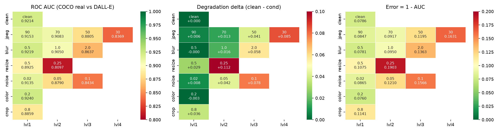

# Results — frozen_siglip2_giant

Auto-generated by `python scripts/make_results.py`. Headline metric: **ROC AUC**.
The designated validation set is class-imbalanced (real:fake about 1:1.77, majority-class accuracy about 0.65), so accuracy is never reported without balanced accuracy and that baseline beside it. Every row is reported against two independent real sets — COCO (the organisers' reals) and a held-out ImageNet set — because a large gap between them would indicate the model learned "looks like COCO" rather than "is real".

## frozen_siglip2_giant

`google/siglip2-giant-opt-patch16-384` — 1.164 B parameters (hard limit 2 B, asserted at every model load)

| Measurement | AUC | error (1 − AUC) |
|---|---|---|
| clean, **full** designated val set (n=13841) | **0.9309** | 0.0691 |
| clean, full set **deduplicated** (n=8717: 4998 real / 3719 unique fake) | 0.9313 | 0.0687 |
| clean, eval subset, fakes vs COCO reals | 0.9214 | 0.0786 |
| clean, eval subset, fakes vs **ImageNet (alt) reals** | 0.9484 | 0.0516 |
| worst single transform: `resize@0.25` | 0.8097 (alt real 0.8640) | 0.1903 |

**Shortcut gap (COCO-real AUC − alt-real AUC, clean): -0.0270** — a large positive gap would mean the model is exploiting the COCO capture pipeline rather than detecting generation.

Max degradation delta: **0.1118** · mean degraded AUC: 0.8842

Accuracy at threshold 0.5 on the full set: 0.8637, balanced accuracy 0.8602 — against a majority-class baseline of 0.6545 (class ratio 1:1.89).

### Per-transform grid (eval subset)

| transform   |   level |   auc_coco_real |   delta_coco |   err_coco_real |   auc_alt_real |   shortcut_gap |   bal_acc@0.5 |
|:------------|--------:|----------------:|-------------:|----------------:|---------------:|---------------:|--------------:|
| clean       |         |          0.9214 |       0.0000 |          0.0786 |         0.9484 |        -0.0270 |        0.8531 |
| jpeg        | 90.0000 |          0.9153 |       0.0061 |          0.0847 |         0.9437 |        -0.0284 |        0.8438 |
| jpeg        | 70.0000 |          0.9083 |       0.0132 |          0.0917 |         0.9424 |        -0.0341 |        0.8283 |
| jpeg        | 50.0000 |          0.8805 |       0.0410 |          0.1195 |         0.9247 |        -0.0443 |        0.7941 |
| jpeg        | 30.0000 |          0.8369 |       0.0846 |          0.1631 |         0.8990 |        -0.0621 |        0.7448 |
| blur        |  0.5000 |          0.9219 |      -0.0005 |          0.0781 |         0.9481 |        -0.0261 |        0.8527 |
| blur        |  1.0000 |          0.9050 |       0.0165 |          0.0950 |         0.9366 |        -0.0316 |        0.8197 |
| blur        |  2.0000 |          0.8637 |       0.0577 |          0.1363 |         0.9107 |        -0.0470 |        0.7540 |
| resize      |  0.5000 |          0.8925 |       0.0289 |          0.1075 |         0.9300 |        -0.0375 |        0.7935 |
| resize      |  0.2500 |          0.8097 |       0.1118 |          0.1903 |         0.8640 |        -0.0544 |        0.6524 |
| noise       |  0.0200 |          0.9135 |       0.0080 |          0.0865 |         0.9452 |        -0.0317 |        0.8398 |
| noise       |  0.0500 |          0.8790 |       0.0425 |          0.1210 |         0.9220 |        -0.0430 |        0.8083 |
| noise       |  0.1000 |          0.8434 |       0.0781 |          0.1566 |         0.8913 |        -0.0479 |        0.7565 |
| color       |  0.2000 |          0.9240 |      -0.0026 |          0.0760 |         0.9510 |        -0.0270 |        0.8584 |
| crop        |  0.8000 |          0.8859 |       0.0356 |          0.1141 |         0.9237 |        -0.0378 |        0.7873 |

### Data ablation: `sid_only_ablation`

Same frozen features and the same head-training procedure — only the training sources differ.

| transform   |   level |   auc_coco_real |   delta_coco |   auc_alt_real |
|:------------|--------:|----------------:|-------------:|---------------:|
| clean       |         |          0.9924 |       0.0000 |         0.9944 |
| jpeg        | 90.0000 |          0.9905 |       0.0019 |         0.9931 |
| jpeg        | 70.0000 |          0.9918 |       0.0006 |         0.9941 |
| jpeg        | 50.0000 |          0.9932 |      -0.0008 |         0.9950 |
| jpeg        | 30.0000 |          0.9928 |      -0.0004 |         0.9952 |
| blur        |  0.5000 |          0.9900 |       0.0024 |         0.9932 |
| blur        |  1.0000 |          0.9914 |       0.0010 |         0.9951 |
| blur        |  2.0000 |          0.9912 |       0.0012 |         0.9948 |
| resize      |  0.5000 |          0.9914 |       0.0010 |         0.9951 |
| resize      |  0.2500 |          0.9942 |      -0.0018 |         0.9968 |
| noise       |  0.0200 |          0.9917 |       0.0007 |         0.9947 |
| noise       |  0.0500 |          0.9959 |      -0.0035 |         0.9975 |
| noise       |  0.1000 |          0.9982 |      -0.0058 |         0.9988 |
| color       |  0.2000 |          0.9909 |       0.0014 |         0.9940 |
| crop        |  0.8000 |          0.9888 |       0.0036 |         0.9921 |

### Operating points (clean images)

`FPR_real` is the fraction of genuine photos wrongly flagged; on a platform serving billions of images this is the cost that matters, which is why it is reported per threshold rather than only as a single accuracy figure.

|   threshold |   FPR_real |   TPR_fake | note        |
|------------:|-----------:|-----------:|:------------|
|      0.1000 |     0.4689 |     0.9496 |             |
|      0.2000 |     0.3300 |     0.9251 |             |
|      0.3000 |     0.2475 |     0.9030 |             |
|      0.4000 |     0.2041 |     0.8785 |             |
|      0.5000 |     0.1548 |     0.8610 |             |
|      0.6000 |     0.1172 |     0.8373 |             |
|      0.7000 |     0.0970 |     0.8105 |             |
|      0.8000 |     0.0796 |     0.7800 |             |
|      0.9000 |     0.0420 |     0.7212 |             |
|      0.9500 |     0.0203 |     0.6532 |             |
|      0.9900 |     0.0058 |     0.4408 |             |
|      0.9966 |     0.0000 |     0.2903 | @FPR<=0.001 |
|      0.9740 |     0.0087 |     0.5684 | @FPR<=0.01  |
|      0.8771 |     0.0492 |     0.7403 | @FPR<=0.05  |

### Figures

- ROC curve: `eval/roc.png`
- FPR vs threshold: `eval/fpr_vs_threshold.png`
- Error analysis contact sheets: `eval/errors_fp.png` (false positives), `eval/errors_fn.png` (false negatives), `eval/errors_top.csv`
- Checkpoint / training history: `head_best.pt`, `train_history.json`

