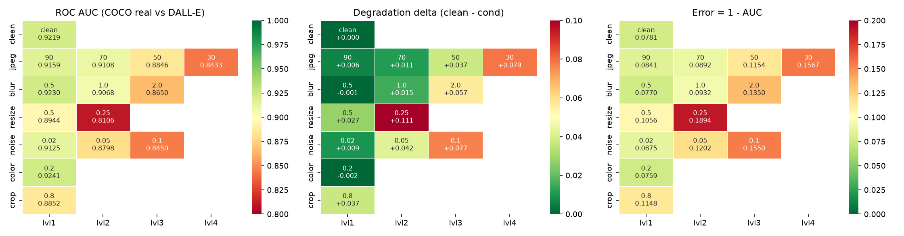

# Results — frozen_siglip2_giant_harmonized

Auto-generated by `python scripts/make_results.py`. Headline metric: **ROC AUC**.
The designated validation set is class-imbalanced (real:fake about 1:1.77, majority-class accuracy about 0.65), so accuracy is never reported without balanced accuracy and that baseline beside it. Every row is reported against two independent real sets — COCO (the organisers' reals) and a held-out ImageNet set — because a large gap between them would indicate the model learned "looks like COCO" rather than "is real".

## frozen_siglip2_giant_harmonized

`google/siglip2-giant-opt-patch16-384` — 1.164 B parameters (hard limit 2 B, asserted at every model load)

| Measurement | AUC | error (1 − AUC) |
|---|---|---|
| clean, **full** designated val set (n=13841) | **0.9316** | 0.0684 |
| clean, full set **deduplicated** (n=8717: 4998 real / 3719 unique fake) | 0.9318 | 0.0682 |
| clean, eval subset, fakes vs COCO reals | 0.9219 | 0.0781 |
| clean, eval subset, fakes vs **ImageNet (alt) reals** | 0.9487 | 0.0513 |
| worst single transform: `resize@0.25` | 0.8106 (alt real 0.8648) | 0.1894 |

**Shortcut gap (COCO-real AUC − alt-real AUC, clean): -0.0268** — a large positive gap would mean the model is exploiting the COCO capture pipeline rather than detecting generation.

Max degradation delta: **0.1113** · mean degraded AUC: 0.8858

Accuracy at threshold 0.5 on the full set: 0.8649, balanced accuracy 0.8621 — against a majority-class baseline of 0.6545 (class ratio 1:1.89).

### Per-transform grid (eval subset)

| transform   |   level |   auc_coco_real |   delta_coco |   err_coco_real |   auc_alt_real |   shortcut_gap |   bal_acc@0.5 |
|:------------|--------:|----------------:|-------------:|----------------:|---------------:|---------------:|--------------:|
| clean       |         |          0.9219 |       0.0000 |          0.0781 |         0.9487 |        -0.0268 |        0.8519 |
| jpeg        | 90.0000 |          0.9159 |       0.0061 |          0.0841 |         0.9441 |        -0.0282 |        0.8449 |
| jpeg        | 70.0000 |          0.9108 |       0.0112 |          0.0892 |         0.9438 |        -0.0330 |        0.8341 |
| jpeg        | 50.0000 |          0.8846 |       0.0374 |          0.1154 |         0.9273 |        -0.0427 |        0.8024 |
| jpeg        | 30.0000 |          0.8433 |       0.0786 |          0.1567 |         0.9038 |        -0.0605 |        0.7473 |
| blur        |  0.5000 |          0.9230 |      -0.0011 |          0.0770 |         0.9489 |        -0.0259 |        0.8516 |
| blur        |  1.0000 |          0.9068 |       0.0151 |          0.0932 |         0.9376 |        -0.0308 |        0.8249 |
| blur        |  2.0000 |          0.8650 |       0.0570 |          0.1350 |         0.9116 |        -0.0466 |        0.7518 |
| resize      |  0.5000 |          0.8944 |       0.0275 |          0.1056 |         0.9314 |        -0.0370 |        0.7956 |
| resize      |  0.2500 |          0.8106 |       0.1113 |          0.1894 |         0.8648 |        -0.0542 |        0.6484 |
| noise       |  0.0200 |          0.9125 |       0.0094 |          0.0875 |         0.9444 |        -0.0319 |        0.8373 |
| noise       |  0.0500 |          0.8798 |       0.0421 |          0.1202 |         0.9226 |        -0.0427 |        0.8044 |
| noise       |  0.1000 |          0.8450 |       0.0769 |          0.1550 |         0.8924 |        -0.0474 |        0.7628 |
| color       |  0.2000 |          0.9241 |      -0.0021 |          0.0759 |         0.9510 |        -0.0269 |        0.8584 |
| crop        |  0.8000 |          0.8852 |       0.0367 |          0.1148 |         0.9234 |        -0.0382 |        0.7925 |

### Data ablation: `sid_plus_dalle2`

Same frozen features and the same head-training procedure — only the training sources differ.

Trained on 13000 features from sources matching `['sid_set', 'DALLE2']`. Clean AUC (full set) **0.9691**, worst cell `resize@0.25` 0.8710, max delta 0.0912.

| transform   |   level |   auc_coco_real |   delta_coco |   err_coco_real |   auc_alt_real |   shortcut_gap |
|:------------|--------:|----------------:|-------------:|----------------:|---------------:|---------------:|
| clean       |         |          0.9622 |       0.0000 |          0.0378 |         0.9683 |        -0.0061 |
| jpeg        | 90.0000 |          0.9575 |       0.0047 |          0.0425 |         0.9645 |        -0.0070 |
| jpeg        | 70.0000 |          0.9536 |       0.0086 |          0.0464 |         0.9634 |        -0.0097 |
| jpeg        | 50.0000 |          0.9369 |       0.0254 |          0.0631 |         0.9523 |        -0.0154 |
| jpeg        | 30.0000 |          0.9121 |       0.0502 |          0.0879 |         0.9353 |        -0.0233 |
| blur        |  0.5000 |          0.9615 |       0.0008 |          0.0385 |         0.9677 |        -0.0062 |
| blur        |  1.0000 |          0.9481 |       0.0142 |          0.0519 |         0.9581 |        -0.0100 |
| blur        |  2.0000 |          0.9163 |       0.0459 |          0.0837 |         0.9323 |        -0.0159 |
| resize      |  0.5000 |          0.9389 |       0.0234 |          0.0611 |         0.9519 |        -0.0130 |
| resize      |  0.2500 |          0.8710 |       0.0912 |          0.1290 |         0.8861 |        -0.0151 |
| noise       |  0.0200 |          0.9585 |       0.0038 |          0.0415 |         0.9673 |        -0.0089 |
| noise       |  0.0500 |          0.9388 |       0.0234 |          0.0612 |         0.9522 |        -0.0134 |
| noise       |  0.1000 |          0.9125 |       0.0497 |          0.0875 |         0.9243 |        -0.0118 |
| color       |  0.2000 |          0.9647 |      -0.0024 |          0.0353 |         0.9710 |        -0.0064 |
| crop        |  0.8000 |          0.9385 |       0.0237 |          0.0615 |         0.9488 |        -0.0102 |

### Data ablation: `sid_plus_laion`

Same frozen features and the same head-training procedure — only the training sources differ.

Trained on 14000 features from sources matching `['sid_set', 'laion5b']`. Clean AUC (full set) **0.9891**, worst cell `crop@0.8` 0.9851, max delta 0.0012.

| transform   |   level |   auc_coco_real |   delta_coco |   err_coco_real |   auc_alt_real |   shortcut_gap |
|:------------|--------:|----------------:|-------------:|----------------:|---------------:|---------------:|
| clean       |         |          0.9863 |       0.0000 |          0.0137 |         0.9926 |        -0.0063 |
| jpeg        | 90.0000 |          0.9870 |      -0.0007 |          0.0130 |         0.9929 |        -0.0059 |
| jpeg        | 70.0000 |          0.9889 |      -0.0025 |          0.0111 |         0.9940 |        -0.0051 |
| jpeg        | 50.0000 |          0.9897 |      -0.0034 |          0.0103 |         0.9943 |        -0.0046 |
| jpeg        | 30.0000 |          0.9884 |      -0.0021 |          0.0116 |         0.9942 |        -0.0058 |
| blur        |  0.5000 |          0.9865 |      -0.0001 |          0.0135 |         0.9930 |        -0.0065 |
| blur        |  1.0000 |          0.9885 |      -0.0022 |          0.0115 |         0.9950 |        -0.0065 |
| blur        |  2.0000 |          0.9869 |      -0.0006 |          0.0131 |         0.9941 |        -0.0072 |
| resize      |  0.5000 |          0.9881 |      -0.0017 |          0.0119 |         0.9947 |        -0.0067 |
| resize      |  0.2500 |          0.9915 |      -0.0051 |          0.0085 |         0.9966 |        -0.0051 |
| noise       |  0.0200 |          0.9854 |       0.0010 |          0.0146 |         0.9925 |        -0.0071 |
| noise       |  0.0500 |          0.9909 |      -0.0046 |          0.0091 |         0.9957 |        -0.0048 |
| noise       |  0.1000 |          0.9950 |      -0.0087 |          0.0050 |         0.9977 |        -0.0027 |
| color       |  0.2000 |          0.9866 |      -0.0002 |          0.0134 |         0.9932 |        -0.0066 |
| crop        |  0.8000 |          0.9851 |       0.0012 |          0.0149 |         0.9924 |        -0.0072 |

### Data ablation: `sid_set`

Same frozen features and the same head-training procedure — only the training sources differ.

Trained on 8000 features from sources matching `['sid_set']`. Clean AUC (full set) **0.9932**, worst cell `crop@0.8` 0.9899, max delta 0.0016.

| transform   |   level |   auc_coco_real |   delta_coco |   err_coco_real |   auc_alt_real |   shortcut_gap |
|:------------|--------:|----------------:|-------------:|----------------:|---------------:|---------------:|
| clean       |         |          0.9915 |       0.0000 |          0.0085 |         0.9936 |        -0.0021 |
| jpeg        | 90.0000 |          0.9914 |       0.0001 |          0.0086 |         0.9934 |        -0.0020 |
| jpeg        | 70.0000 |          0.9922 |      -0.0007 |          0.0078 |         0.9942 |        -0.0020 |
| jpeg        | 50.0000 |          0.9930 |      -0.0015 |          0.0070 |         0.9947 |        -0.0017 |
| jpeg        | 30.0000 |          0.9923 |      -0.0007 |          0.0077 |         0.9947 |        -0.0024 |
| blur        |  0.5000 |          0.9914 |       0.0001 |          0.0086 |         0.9939 |        -0.0025 |
| blur        |  1.0000 |          0.9928 |      -0.0013 |          0.0072 |         0.9958 |        -0.0029 |
| blur        |  2.0000 |          0.9916 |      -0.0001 |          0.0084 |         0.9949 |        -0.0033 |
| resize      |  0.5000 |          0.9923 |      -0.0008 |          0.0077 |         0.9955 |        -0.0031 |
| resize      |  0.2500 |          0.9941 |      -0.0026 |          0.0059 |         0.9967 |        -0.0026 |
| noise       |  0.0200 |          0.9920 |      -0.0005 |          0.0080 |         0.9947 |        -0.0027 |
| noise       |  0.0500 |          0.9959 |      -0.0044 |          0.0041 |         0.9973 |        -0.0014 |
| noise       |  0.1000 |          0.9982 |      -0.0066 |          0.0018 |         0.9986 |        -0.0005 |
| color       |  0.2000 |          0.9919 |      -0.0004 |          0.0081 |         0.9943 |        -0.0025 |
| crop        |  0.8000 |          0.9899 |       0.0016 |          0.0101 |         0.9928 |        -0.0028 |

### Data ablation: `wildfake`

Same frozen features and the same head-training procedure — only the training sources differ.

Trained on 11000 features from sources matching `['wildfake']`. Clean AUC (full set) **0.6234**, worst cell `noise@0.1` 0.2633, max delta 0.3463.

| transform   |   level |   auc_coco_real |   delta_coco |   err_coco_real |   auc_alt_real |   shortcut_gap |
|:------------|--------:|----------------:|-------------:|----------------:|---------------:|---------------:|
| clean       |         |          0.6096 |       0.0000 |          0.3904 |         0.7017 |        -0.0922 |
| jpeg        | 90.0000 |          0.5784 |       0.0311 |          0.4216 |         0.6745 |        -0.0960 |
| jpeg        | 70.0000 |          0.5433 |       0.0662 |          0.4567 |         0.6543 |        -0.1109 |
| jpeg        | 50.0000 |          0.4222 |       0.1873 |          0.5778 |         0.5377 |        -0.1155 |
| jpeg        | 30.0000 |          0.3096 |       0.3000 |          0.6904 |         0.4288 |        -0.1192 |
| blur        |  0.5000 |          0.6134 |      -0.0038 |          0.3866 |         0.6983 |        -0.0849 |
| blur        |  1.0000 |          0.4866 |       0.1229 |          0.5134 |         0.5739 |        -0.0872 |
| blur        |  2.0000 |          0.3511 |       0.2584 |          0.6489 |         0.4452 |        -0.0941 |
| resize      |  0.5000 |          0.4438 |       0.1658 |          0.5562 |         0.5404 |        -0.0966 |
| resize      |  0.2500 |          0.2668 |       0.3427 |          0.7332 |         0.3409 |        -0.0741 |
| noise       |  0.0200 |          0.5821 |       0.0274 |          0.4179 |         0.6796 |        -0.0975 |
| noise       |  0.0500 |          0.3820 |       0.2275 |          0.6180 |         0.4840 |        -0.1020 |
| noise       |  0.1000 |          0.2633 |       0.3463 |          0.7367 |         0.3444 |        -0.0811 |
| color       |  0.2000 |          0.6209 |      -0.0114 |          0.3791 |         0.7119 |        -0.0910 |
| crop        |  0.8000 |          0.4952 |       0.1143 |          0.5048 |         0.5983 |        -0.1031 |

### Operating points (clean images)

`FPR_real` is the fraction of genuine photos wrongly flagged; on a platform serving billions of images this is the cost that matters, which is why it is reported per threshold rather than only as a single accuracy figure.

|   threshold |   FPR_real |   TPR_fake | note        |
|------------:|-----------:|-----------:|:------------|
|      0.1000 |     0.4689 |     0.9473 |             |
|      0.2000 |     0.3242 |     0.9274 |             |
|      0.3000 |     0.2446 |     0.9045 |             |
|      0.4000 |     0.1968 |     0.8778 |             |
|      0.5000 |     0.1548 |     0.8587 |             |
|      0.6000 |     0.1158 |     0.8335 |             |
|      0.7000 |     0.0999 |     0.8067 |             |
|      0.8000 |     0.0738 |     0.7823 |             |
|      0.9000 |     0.0449 |     0.7265 |             |
|      0.9500 |     0.0217 |     0.6593 |             |
|      0.9900 |     0.0058 |     0.4500 |             |
|      0.9966 |     0.0000 |     0.3010 | @FPR<=0.001 |
|      0.9740 |     0.0087 |     0.5775 | @FPR<=0.01  |
|      0.8802 |     0.0492 |     0.7395 | @FPR<=0.05  |

### Figures

- ROC curve: `eval/roc.png`
- FPR vs threshold: `eval/fpr_vs_threshold.png`
- Error analysis contact sheets: `eval/errors_fp.png` (false positives), `eval/errors_fn.png` (false negatives), `eval/errors_top.csv`
- Checkpoint / training history: `head_best.pt`, `train_history.json`

